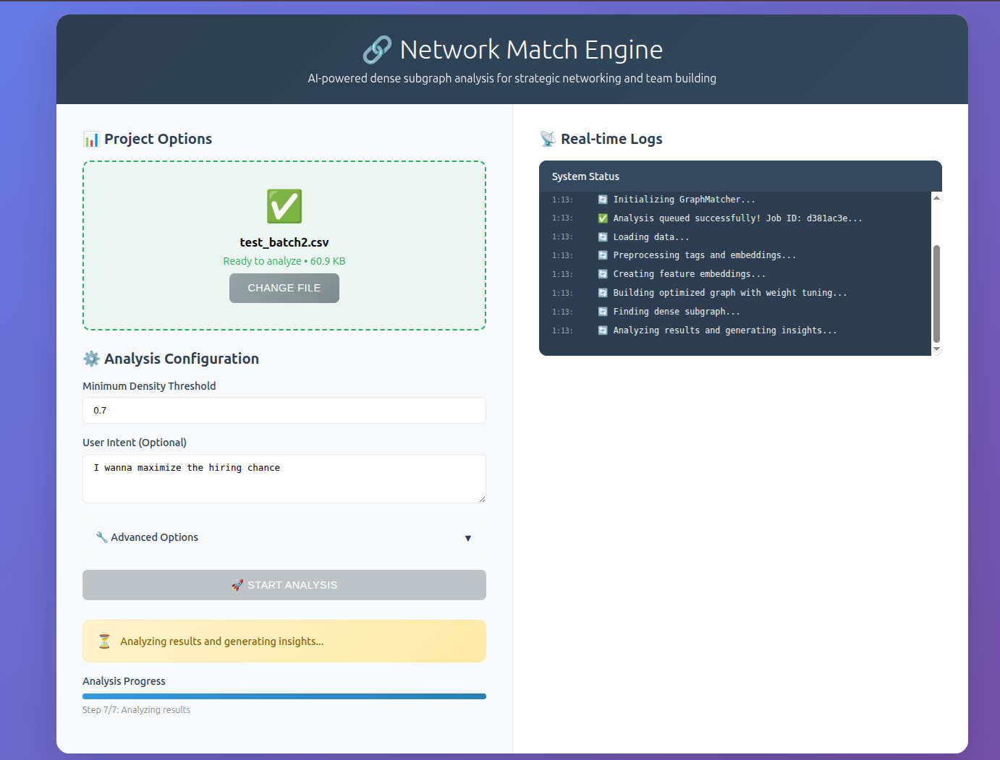
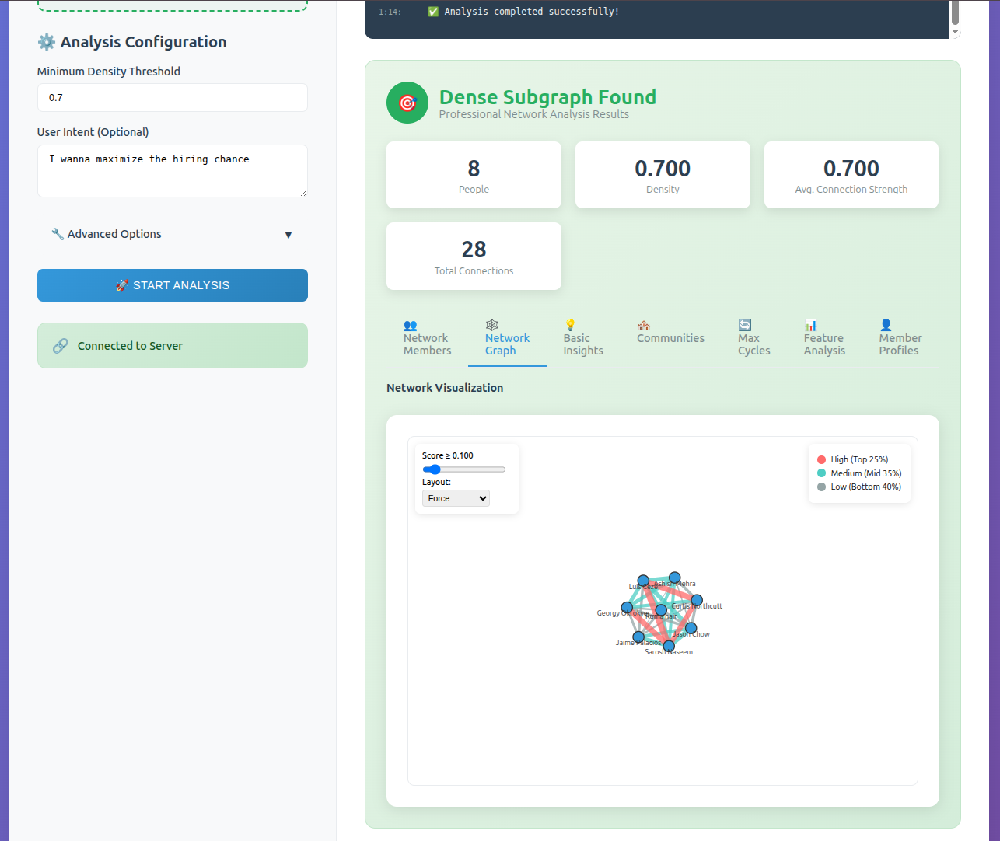

# Match Engine

[](https://github.com/amk9978/people_match_engine/actions/workflows/ci-cd.yml)
[](LICENSE)

Point it at a roster of people and it returns the group most worth putting in a
room together.

Everyone on the list is a node. Every pair gets an edge weighted by two signals,
how alike the two are and how well they complete each other. The densest group
in that graph is the answer.





## Quickstart

```bash
git clone https://github.com/amk9978/people_match_engine
cd people_match_engine
cp .env.example .env          # set OPENAI_API_KEY
docker compose up -d
```

```bash
curl -X POST http://localhost:8000/analyze \
  -H "X-User-ID: me" \
  -F "file=@docs/sample.csv" \
  -F "prompt=I am hiring engineers for a fintech startup"
```

The response carries a job id. Poll `/jobs/{job_id}` or subscribe to
`/ws/{client_id}` for progress, then read `/jobs/{job_id}/result`.

Redis is optional. Without one the engine caches in memory for the life of the
process and says so at startup. An OpenAI key is required today, because
complementarity is the one step that calls a model. Embeddings already run
locally through `fastembed`.

## Your CSV

Any CSV works. Give it a column naming each person and at least one column of
text worth comparing.

```
Person Name,Person Company,Professional Identity - Role Specification,...
Gaurav Bharaj,Reality Defender,Co-Founder & Head of AI | C-Suite Executive Level | ...
```

The engine reads the columns off the file, ranks them by how many distinct
values they hold, and infers each one's tag separator. To name them yourself,
write a mapping and set `FEATURE_MAPPING_PATH`:

```yaml
name_column: Attendee
company_column: Employer
features:
  - name: skills
    column: What they do
    separator: "|"
  - name: seeking
    column: Looking for
```

[`presets/vendor_six_column.yaml`](presets/vendor_six_column.yaml) is the layout
[`docs/sample.csv`](docs/sample.csv) uses.

## How a run works

Seven steps, in order.

1. **Map.** The CSV becomes a feature set, one descriptor per scored column.
2. **Embed.** Each column becomes a vector per person, then a similarity matrix.
3. **Score.** A model rates how complementary each pair of profile values is,
   per feature.
4. **Measure.** Informativeness comes off the raw matrices as the interquartile
   range of their pair scores. A column where everyone looks alike weighs
   nothing.
5. **Interpret.** Your sentence becomes a per-feature importance and a
   direction. Direction is what lets one run ask for the same industry and a
   different role.
6. **Calibrate.** Both matrices are rank normalized, so 0.8 means the 80th
   percentile pair whichever feature produced it.
7. **Combine.** The three factors multiply into weights, and a weighted power
   mean turns each pair into one edge.

Greedy peeling then drops the lightest node each pass and keeps the densest
working graph it sees, which is the standard approximation for this objective.

Step 5 is the only one that needs your intent. With no prompt, importance is
uniform and the weights reduce to what the data alone supports.

## What is unusual here

Four things, each checkable in the code.

1. **Built for professional networking.** The open source team formation tools
   in this space assign students to coursework groups.
2. **Complementarity is a first-class signal.** It gets its own matrix and its
   own weight vector beside similarity, and the two are weighted separately.
3. **Intent chooses the match type at run time.** One roster answers "find me an
   investor" and "find me a co-founder" differently, from the same graph.
4. **It installs.** The rest of this space is papers and hosted platforms.

### Prior art

Densest-subgraph team formation is published work. The objective appears in
[Gajewar and Das Sarma, 2011](https://arxiv.org/abs/1102.3340) and in
[Rangapuram, Bühler and Hein, 2015](https://arxiv.org/abs/1505.06661), and
complementarity beside similarity appears in the C3 synergy work and in TeamUp.
The overlap is at the objective. The mechanisms diverge below it.

| | Published work | This engine |
|---|---|---|
| Graph source | an existing social or collaboration network | built from text embeddings of profile columns |
| Complementarity | skill coverage constraints, or embedding variance as a diversity proxy | scored per feature by a model, in its own matrix |
| Weighting | fixed in the objective | resolved per run from a sentence of intent |
| Edge weight | unweighted or single-signal | weighted power mean over two signals |

## API

Interactive docs at `http://localhost:8000/docs`.

| Endpoint | Method | Purpose |
|---|---|---|
| `/analyze` | POST | Upload a CSV and start a run |
| `/jobs/{job_id}` | GET | Progress and status |
| `/jobs/{job_id}/result` | GET | The finished analysis |
| `/jobs` | GET | List runs, filtered by status |
| `/files` | GET | Uploaded files for the calling user |
| `/ws/{client_id}` | WS | Live progress |

`X-User-ID` is a trusted header, so anyone who can reach the API can claim any
user id. Put it behind your own auth before exposing it.

## Limits

The graph is complete, so memory and peeling time grow as N². A few hundred
people is comfortable and a few thousand is where the graph itself becomes the
constraint, ahead of the model.

Complementarity is quadratic in distinct profile values per feature. The run
reports how many pairs it actually scored and how many fell back to a neutral
value, so a result that fabricated its scores says so.

## What is next

- A CLI and a `pip install`, so a first result needs no Docker
- Per-person recommendations, which the graph already contains and does not show
- A local complementarity scorer, removing the API key from the default path
- Splitting the subgraph analyzer and making its more expensive analyses opt-in

## Credit

The complementarity design, from the idea through the implementation, is
[Amir Karimi](https://github.com/amk9978)'s own, worked out without knowledge of
the academic work cited above.

Apache 2.0. See [LICENSE](LICENSE).
