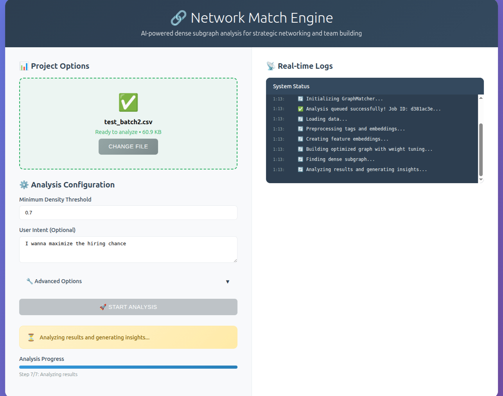

# 🎯 Match Engine

[](https://github.com/amk9978/people_match_engine/actions/workflows/ci-cd.yml)

**Enterprise-grade Professional Network Analysis Platform**

[Try Here!](http://54.242.164.134:8000/)

A sophisticated graph-based matching system that discovers optimal professional communities using advanced multi-feature
similarity and AI-powered complementarity analysis. Built for scalable network intelligence with real-time processing
capabilities.

[](https://fastapi.tiangolo.com/)
[](https://redis.io/)
[](https://networkx.org/)
[](https://openai.com/)




## 🚀 What Makes It Powerful

**Match Engine** revolutionizes professional network analysis by combining traditional graph algorithms with modern AI
to find the most strategically valuable professional communities. Unlike simple similarity matching, our system
understands the **complementary value** of professional relationships.

### 🎪 **The Magic Behind the System**

1. **🔍 Intelligent Data Processing** - Uploads professional CSV data with automatic deduplication and tag extraction
2. **🤖 AI-Powered Complementarity Analysis** - ChatGPT analyzes complete professional profiles to score strategic
   relationship value
3. **⚖️ Dynamic Weight Optimization** - Auto-tunes similarity vs complementarity weights based on user intent prompts
4. **🕸️ Advanced Graph Construction** - Builds weighted networks combining embedding similarity with AI-scored
   complementarity
5. **💎 Dense Subgraph Discovery** - Employs sophisticated algorithms to find the most connected professional communities
6. **📊 Real-Time Insights** - WebSocket-powered live updates with comprehensive visualization and analytics

## 🏗️ System Architecture

### **System Flow Architecture**

```
User Request → REST API → Preprocessing → Embedding Tags → Semantic Preprocessing → 
Similarity Matrices → Complementarity Matrices → Hyperparameter Tuning → 
Graph Building → Dense Subgraph Discovery → Subgraph Analysis → Frontend Rendering
```

**Performance Layer:**

- **Caching:** Redis stores preprocessing results, embeddings, and computed matrices
- **Batching:** Bulk operations for semantic deduplication and matrix computation
- **FAISS:** High-performance vector similarity search for large datasets
- **Async:** Concurrent processing for matrix building and AI scoring operations
- **Generalized Mean:** Leverages power mean inequality to optimally combine similarity and complementarity scores,
  ensuring mathematically sound edge weight aggregation that preserves feature relationships
- **Supporting OpenAI embedding as well as FastEmbed through design by interface**

#### **🔄 System Flow Details**

1. **👤 User Request** - CSV upload with optional intent prompt via REST API
2. **🌐 REST API** - FastAPI endpoints handle requests with async processing
3. **🧹 Preprocessing** - Remove partial records, validate data integrity
4. **🏷️ Embedding Tags** - Convert text features to vector representations
5. **🤖 Semantic Preprocessing** - AI-powered deduplication of similar tags/profiles
6. **📊 Similarity Matrices** - Compute feature-based similarity scores
7. **🔄 Complementarity Matrices** - AI-analyzed strategic relationship value
8. **⚙️ Hyperparameter Tuning** - Auto-optimize similarity/complementarity weights
9. **🕸️ Graph Building** - Calculate edge weights using **generalized mean** for optimal aggregation
10. **💎 Dense Subgraph Discovery** - Find maximum density professional communities
11. **📈 Subgraph Analysis** - Extract insights, cycles, and community structure
12. **🎨 Frontend Rendering** - Interactive visualizations with real-time updates

#### **⚡ Performance Optimizations**

- **💾 Redis Caching** - Persistent storage for embeddings, matrices, and results
- **🔍 FAISS Integration** - High-performance vector similarity search for large datasets
- **📦 Batch Processing** - Optimized bulk operations for semantic preprocessing
- **⚡ Async Operations** - Concurrent matrix building and API request handling
- **🧮 Generalized Mean** - Applies power mean inequality for provably optimal aggregation of multiple similarity scores into edge weights

## 🛠️ Quick Start

### Prerequisites

- Docker & Docker Compose
- OpenAI API key
- Redis instance

### Installation

```bash
git clone https://github.com/amk9978/people_match_engine
cd match_engine

# Configure environment
cp .env.example .env
# Edit .env with your OpenAI API key and Redis config

# Launch the system
docker compose up -d
```

### Usage Example

```bash
curl -X POST "http://localhost:8000/analyze" \
  -H "X-User-ID: startup_founder" \
  -F "file=@team_candidates.csv" \
  -F "prompt=I'm building a fintech startup and need complementary technical and business expertise"
```

## 🎨 Core Capabilities

### **🧠 AI-Powered Analysis**

- **Multi-Dimensional Matching** - Analyzes role, experience, persona, industry, market, and offerings
- **Strategic Complementarity Scoring** - ChatGPT evaluates professional synergy potential
- **Intent-Aware Optimization** - Dynamically adjusts matching criteria based on user goals
- **Advanced Graph Algorithms** - Employs density-based subgraph mining and community detection

### **⚡ Performance & Scale**

- **Real-Time Processing** - WebSocket-powered live analysis updates
- **Enterprise Caching** - Redis-backed performance optimization
- **FAISS Integration** - Vector similarity search for large datasets
- **Async Architecture** - Concurrent processing for maximum throughput

### **📊 Professional Analytics**

- **Maximum Weight Cycles** - Discovers optimal professional collaboration chains
- **Community Detection** - Identifies natural professional clusters using Louvain/Greedy Modularity
- **Feature Importance Analysis** - Reveals which attributes drive the strongest connections
- **Interactive Visualizations** - D3.js-powered network graphs with MDS layout

### **🔧 Enterprise Features**

- **Job Persistence** - Redis-backed result storage with job ID retrieval
- **Dataset Versioning** - Track changes, revert, and analyze different data versions
- **Multi-User Support** - User profiles with usage statistics and file management
- **Flexible Data Input** - CSV upload with automatic validation and preprocessing

## 📚 API Documentation

Access the **interactive OpenAPI documentation** at `http://localhost:8000/docs`

### **🔑 Core Endpoints**

| Endpoint                        | Method    | Purpose                                                    |
|---------------------------------|-----------|------------------------------------------------------------|
| `/analyze`                      | POST      | Upload CSV and initiate analysis with optional user prompt |
| `/jobs/{job_id}`                | GET       | Monitor analysis progress and retrieve status              |
| `/jobs/{job_id}/result`         | GET       | Retrieve completed analysis results from Redis             |
| `/users/me`                     | GET       | User profile, statistics, and file management              |
| `/datasets/{filename}/add-rows` | POST      | Dynamically modify datasets with new entries               |
| `/cache/info`                   | GET       | Redis performance metrics and cache statistics             |
| `/ws/{client_id}`               | WebSocket | Real-time analysis updates and progress monitoring         |

### **📤 Response Examples**

<details>
<summary><b>Analysis Results Structure</b></summary>

```json
{
  "job_id": "uuid-string",
  "subgraph_info": {
    "nodes": [
      "member1",
      "member2",
      "member3"
    ],
    "density": 0.85,
    "communities": {
      "community_1": [
        "member1",
        "member2"
      ],
      "community_2": [
        "member3",
        "member4"
      ]
    },
    "maximum_cycle": {
      "cycle": [
        "member1",
        "member2",
        "member3",
        "member1"
      ],
      "weight": 0.92,
      "summary": "High-synergy collaboration chain"
    },
    "feature_analysis": {
      "most_important_features": [
        "experience",
        "industry"
      ],
      "tuned_weights": {
        "similarity": 0.6,
        "complementarity": 0.4
      }
    },
    "dataset_values": {
      "member1": {
        "role": "Engineer",
        "experience": "5 years"
      },
      "member2": {
        "role": "Designer",
        "experience": "3 years"
      }
    }
  },
  "visualization": {
    "stress_layout": {
      "coordinates": {
        ...
      }
    },
    "edge_weights": {
      ...
    }
  }
}
```

</details>

## 🔮 Future Roadmap

- Swap ChatGPT as a judge with simpler and faster models
- Extend the list of features
- Add human feedbacks to the system (RLHF)
- Use GPU for matrices and graph operations instead of CPU

---
